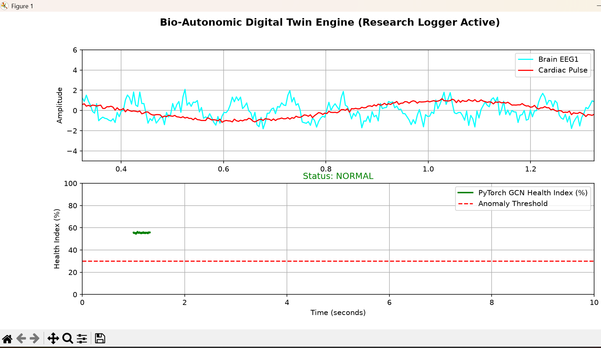

# Bio-Autonomic Digital Twin Engine

An edge-native computational pipeline that ingests real-time multi-modal biosignals ($250\text{ Hz}$), extracts dynamic cross-organ adjacency matrices using `SciPy` zero-phase digital filtering, and processes functional graphs through a **PyTorch Graph Convolutional Network (GCN)** to detect systemic organ-brain decoupling in real time.

## Quick Start

```bash
# Install dependencies
py -m pip install numpy scipy torch matplotlib

# Run real-time GCN engine & live dashboard
py bio_twin.py
